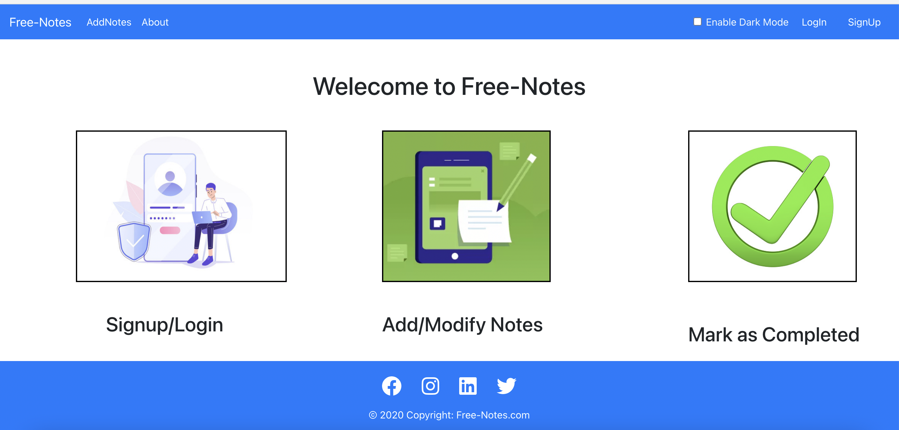
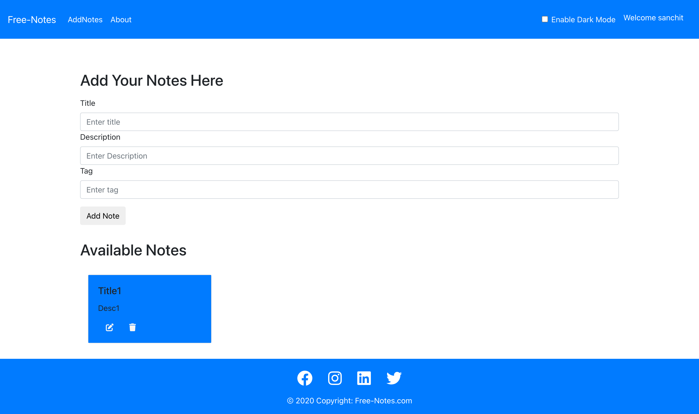

# Free-Notes

   &nbsp&nbsp
  
  
  
  
  

#### Project Category
Express Js, React Js, Node Js, MongoDB, Bootstrap 4, APIs, JWT Token Authentication

#### Basic Info 
This project was created using basic HTML,CSS, React JS,Express JS and little bit of bootstrap 4. It stores the data and fetch the information from the Mongo DB.

#### Description 
This is a MERN Project which basically focuses on performing all the CRUD operations in the application with the help of different APIs. It is a Notes application in which a user can store their notes and perfom CRUD operation as per their choice.
I have also added dark mode functionality to play around with the CSS and make it interesting.

#### Working 
  ##Starting frontend  
  Step 1: npm init  
  Step 2: npm start  
  ##Starting backend (Different Terminal)  
  Step 1: npm init  
  Step 2: npm start
